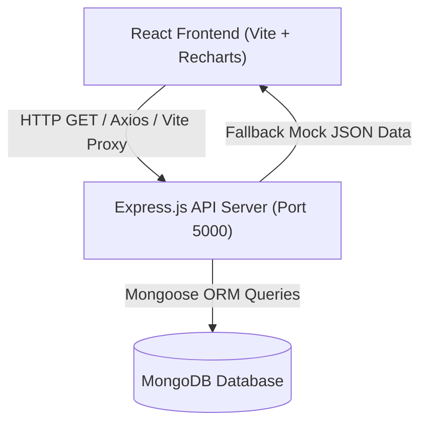

# Full-Stack E-Commerce Analytics Dashboard

A modern, university-grade full-stack E-Commerce Analytics Dashboard built with **React**, **Node.js/Express**, and **MongoDB**. This project provides real-time visualizations for revenue metrics, order statuses, customer insights, and sales distributions.

---

## 📐 1. System Architecture Diagram

Below is the high-level architecture diagram detailing the communication flow between the React Frontend, Node.js API Server, and MongoDB Database.



---

## 🔄 2. Explanation of API Data Flow

1. **User Action / Component Mount:** React components (`Dashboard.jsx`, `Orders.jsx`, `Customers.jsx`) send asynchronous `axios.get('/api/*')` requests on mount.
2. **Vite Reverse Proxy:** Vite proxies incoming requests from `http://localhost:5173/api/*` to the Express backend at `http://localhost:5000/api/*`.
3. **Route & Controller Execution:** Express routes direct requests to corresponding controllers (`orderController.js`, `customerController.js`, etc.).
4. **Mongoose Database Query:** Controllers query MongoDB collections. If the database connection is offline or empty, the controller immediately serves resilient fallback JSON objects to maintain 100% UI uptime.
5. **State Update & Visualization:** React receives JSON payloads, updates component state (`useState`), and renders charts via **Recharts** and tables.

---

## 🌿 3. Git Branching Strategy (Git Flow)

This project strictly adheres to **Git Flow** practices:
* **`main`**: Production-ready code. Hotfixes merge directly here.
* **`develop`**: Integration branch for upcoming releases. Features branch off `develop`.
* **`feature/*`**: Isolated feature branches (`feature/orders-page`, `feature/mongodb-models`). Merge to `develop` via Pull Request.
* **`hotfix/*`**: Quick critical patches directly merged into `main` and `develop`.

---

## 📋 4. Pull Request (PR) Review Checklist

Every PR submitted to `develop` or `main` must pass the following code review standards:

- [x] **Linting & Formatting:** `npm run lint` / Oxlint passes with zero errors.
- [x] **No Secrets:** No hardcoded credentials or `.env` files in git commits.
- [x] **Async Error Handling:** Every API endpoint uses `try...catch` blocks and standard status codes.
- [x] **UI Resilience:** Components include loading states and fallback data rendering.
- [x] **CI/CD Checks:** GitHub Actions automated workflow passes cleanly.

---

## ⚙️ Getting Started & Local Setup

### 1. Backend Setup
```bash
cd backend
npm install
node server.js
```

### 2. Frontend Setup
```bash
cd ../frontend
npm install
npm run dev
```

Open `http://localhost:5173` in your browser.
